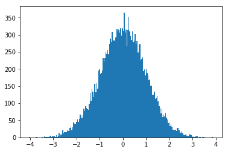

+++
title = "Org-mode example"
date = "2017-11-05"
tags = [ "test" ]
topics = [ "test" ]
+++

# Table of Contents

1.  [Python](#org150675c)
2.  [R](#orgd860e6f)

Here you can find an feature available when using org-mode to write blog article.

# Python

With use here [gregsexton/ob-ipython](https://github.com/gregsexton/ob-ipython) emacs package.

    %matplotlib inline
    import matplotlib.pyplot as plt
    import numpy as np

    plt.hist(np.random.randn(20000), bins=200)

    import numpy as np

# R

    library(ggplot2)

